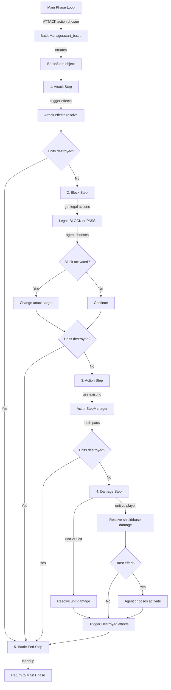

# Battle Manager Refactoring Plan

## Problem Analysis

Currently, battle logic is incorrectly placed in [`simulator/random_agent.py`](simulator/random_agent.py) (lines 347-510), but:

1. **Architecture Issue**: `ActionExecutor` should only execute actions, not contain game logic
2. **Incomplete Implementation**: Current battle is simplified - no proper phases, no blocker, no action step during battle
3. **Skeleton File**: [`simulator/battlemanager.py`](simulator/battlemanager.py) exists but contains only pseudo-code with no proper class definition or imports

## Goal

Move all battle logic from `random_agent.py` into a fully-implemented `BattleManager` class that:

- Handles the complete 5-step battle sequence per game rules
- Integrates with existing `ActionStepManager` for the action step during battle
- Returns legal actions for agents to choose from (block, pass, etc.)
- Separates concerns: Agent chooses, Manager executes

## Architecture Overview



## Game Rules Reference

From [`gamerules.txt`](gamerules.txt:323-351):

**Rule 8-1**: Five battle steps in order: Attack → Block → Action → Damage → Battle End

**Rule 8-2 (Attack Step)**:

- Rest attacking unit
- Declare target (player or rested enemy unit)
- Trigger 【Attack】 effects
- If attacker/defender destroyed, skip to Battle End

**Rule 8-3 (Block Step)**:

- Standby player can activate <Blocker> on active unit
- Only once per attack
- Original target cannot block
- If attacker/defender destroyed, skip to Battle End

**Rule 8-4 (Action Step)**:

- Use existing ActionStepManager logic
- Standby player first, alternates
- If attacker/defender destroyed, skip to Battle End

**Rule 8-5 (Damage Step)**:

- Unit vs Player: Attack shields/base, check Burst
- Unit vs Unit: Simultaneous damage, First Strike priority
- Trigger Destroyed effects, Breach damage

**Rule 8-6 (Battle End Step)**:

- Clear "during this battle" effects
- Return to Main Phase

## Implementation Plan

### Phase 1: Create Proper BattleManager Class

**File:** [`simulator/battlemanager.py`](simulator/battlemanager.py)

**Replace entire file** with proper implementation:

```python
"""
Battle Manager for Gundam Card Game
Handles the complete 5-step battle sequence
"""
from typing import Optional, Tuple, List
from dataclasses import dataclass
from enum import Enum

from simulator.game_manager import GameState
from simulator.unit import UnitInstance
from simulator.keyword_interpreter import KeywordInterpreter, BattlePhase
from simulator.random_agent import Action, ActionType
from simulator.action_step_manager import ActionStepManager


class BattleStep(Enum):
    """Battle step enumeration"""
    ATTACK = "attack"
    BLOCK = "block"
    ACTION = "action"
    DAMAGE = "damage"
    BATTLE_END = "battle_end"


@dataclass
class BattleState:
    """State object for active battle"""
    attacker: UnitInstance
    original_target: str  # "PLAYER" or unit ID
    current_target: Optional[UnitInstance] = None  # None if attacking player
    current_step: BattleStep = BattleStep.ATTACK
    blocker_used: bool = False
    effects_during_battle: List[dict] = None
    
    def __post_init__(self):
        if self.effects_during_battle is None:
            self.effects_during_battle = []


class BattleManager:
    """Manages battle sequence execution"""
    
    @staticmethod
    def start_battle(game_state: GameState, attacker: UnitInstance, 
                    target: str, target_unit: Optional[UnitInstance] = None) -> Tuple[GameState, BattleState]:
        """
        Start a battle sequence.
        
        Args:
            game_state: Current game state
            attacker: Attacking unit
            target: "PLAYER" or "UNIT"
            target_unit: Target unit if attacking a unit
            
        Returns:
            Tuple of (updated game_state, battle_state)
        """
        # Create battle state
        battle_state = BattleState(
            attacker=attacker,
            original_target=target,
            current_target=target_unit if target == "UNIT" else None,
            current_step=BattleStep.ATTACK
        )
        
        # Mark game as in battle
        game_state.in_battle = True
        game_state.battle_attacker = attacker
        game_state.battle_defender = target_unit
        game_state.battle_phase = BattlePhase.DECLARE_ATTACK
        
        return game_state, battle_state
    
    @staticmethod
    def execute_attack_step(game_state: GameState, battle_state: BattleState) -> Tuple[GameState, str]:
        """
        Execute Attack Step (Rule 8-2).
        
        Returns:
            Tuple of (updated game_state, log_message)
        """
        attacker = battle_state.attacker
        
        # Rule 8-2-1: Rest attacker
        attacker.is_rested = True
        
        # Rule 8-2-2: Trigger 【Attack】 effects
        try:
            from simulator.effect_integration import EffectIntegration
            game_state = EffectIntegration.on_unit_attacks(
                game_state, attacker, 
                target=battle_state.original_target
            )
        except Exception as e:
            print(f"  [Attack Effect Error] {e}")
        
        # Rule 8-2-3: "During this battle" effects gain effect now
        # (Tracked in battle_state.effects_during_battle)
        
        log = f"Attack Step: {attacker.card_data.name} attacks"
        if battle_state.current_target:
            log += f" {battle_state.current_target.card_data.name}"
        else:
            log += " player"
        
        return game_state, log
    
    @staticmethod
    def check_units_destroyed_or_moved(battle_state: BattleState) -> bool:
        """
        Rule 8-2-4, 8-3-5, 8-4-2: Check if attacker or defender destroyed/moved.
        
        Returns:
            True if should skip to Battle End Step
        """
        if battle_state.attacker.is_destroyed:
            return True
        
        if battle_state.current_target and battle_state.current_target.is_destroyed:
            return True
        
        # TODO: Check if units moved to another location
        
        return False
    
    @staticmethod
    def get_block_legal_actions(game_state: GameState, battle_state: BattleState) -> List[Action]:
        """
        Get legal actions for Block Step (Rule 8-3).
        
        Returns:
            List of actions (BLOCK with blocker unit, or PASS)
        """
        actions = []
        
        # Rule 8-3-1: Only standby player can block
        standby_player_id = 1 - game_state.turn_player
        standby_player = game_state.players[standby_player_id]
        
        # Rule 8-3: Check for units with <Blocker> that can activate
        for unit in standby_player.battle_area:
            if BattleManager._can_block(unit, battle_state):
                actions.append(Action(
                    ActionType.BLOCK,
                    unit=unit
                ))
        
        # Always can pass
        actions.append(Action(ActionType.PASS))
        
        return actions
    
    @staticmethod
    def _can_block(unit: UnitInstance, battle_state: BattleState) -> bool:
        """Check if unit can activate <Blocker> effect"""
        # Must have Blocker keyword
        if not unit.has_keyword("blocker"):
            return False
        
        # Must be active (not rested)
        if unit.is_rested:
            return False
        
        # Rule 8-3-3: Original target cannot block
        if unit == battle_state.current_target:
            return False
        
        # Attacker with High-Maneuver prevents blocking
        if battle_state.attacker.has_keyword("high_maneuver"):
            return False
        
        return True
    
    @staticmethod
    def execute_block(game_state: GameState, battle_state: BattleState, blocker: UnitInstance) -> Tuple[GameState, str]:
        """
        Execute block action (Rule 8-3-1).
        
        Returns:
            Tuple of (updated game_state, log_message)
        """
        # Change attack target to blocker
        battle_state.current_target = blocker
        battle_state.blocker_used = True
        
        # Update game state battle defender
        game_state.battle_defender = blocker
        
        log = f"Block Step: {blocker.card_data.name} blocks!"
        return game_state, log
    
    @staticmethod
    def execute_action_step(game_state: GameState, battle_state: BattleState, 
                           agents: List) -> Tuple[GameState, List[str]]:
        """
        Execute Action Step during battle (Rule 8-4).
        Uses existing ActionStepManager.
        
        Returns:
            Tuple of (updated game_state, list of log messages)
        """
        logs = []
        logs.append("Action Step (Battle):")
        
        # Use existing ActionStepManager
        game_state = ActionStepManager.enter_action_step(game_state, is_battle=True)
        
        action_step_iterations = 0
        max_iterations = 20
        
        while action_step_iterations < max_iterations:
            legal_actions = ActionStepManager.get_action_step_legal_actions(game_state)
            
            priority_player_id = game_state.action_step_priority_player
            priority_agent = agents[priority_player_id]
            
            chosen_action = priority_agent.choose_action(game_state, legal_actions)
            
            if chosen_action.action_type == ActionType.PASS:
                game_state, continues = ActionStepManager.handle_action_step_action(
                    game_state, chosen_action
                )
                
                if not continues:
                    logs.append("  Both players passed")
                    break
            else:
                # Execute action (command card, etc.)
                from simulator.random_agent import ActionExecutor
                game_state, result = ActionExecutor.execute_action(game_state, chosen_action)
                logs.append(f"  {result}")
                
                game_state, continues = ActionStepManager.handle_action_step_action(
                    game_state, chosen_action
                )
            
            action_step_iterations += 1
        
        game_state = ActionStepManager.exit_action_step(game_state)
        
        return game_state, logs
    
    @staticmethod
    def execute_damage_step(game_state: GameState, battle_state: BattleState) -> Tuple[GameState, List[str]]:
        """
        Execute Damage Step (Rule 8-5).
        
        Returns:
            Tuple of (updated game_state, list of log messages)
        """
        logs = []
        attacker = battle_state.attacker
        
        if battle_state.original_target == "PLAYER":
            # Rule 8-5-2: Attack on Player
            game_state, damage_logs = BattleManager._resolve_player_attack(
                game_state, attacker
            )
            logs.extend(damage_logs)
        else:
            # Rule 8-5-3: Attack on Unit
            defender = battle_state.current_target
            game_state, damage_logs = BattleManager._resolve_unit_attack(
                game_state, attacker, defender
            )
            logs.extend(damage_logs)
        
        return game_state, logs
    
    @staticmethod
    def _resolve_player_attack(game_state: GameState, attacker: UnitInstance) -> Tuple[GameState, List[str]]:
        """Resolve attack on player (shields/base)"""
        logs = []
        opponent_id = 1 - attacker.owner_id
        opponent = game_state.players[opponent_id]
        
        # Rule 8-5-2-4: If base exists, attack base
        if opponent.has_bases():
            base = next((b for b in opponent.bases if b.current_hp > 0), None)
            if base:
                damage = attacker.ap
                base_hp_before = base.current_hp
                
                # Apply First Strike if applicable (Rule 8-5-2-4-2)
                base.take_damage(damage)
                
                logs.append(f"Damage Step: {attacker.card_data.name} dealt {damage} damage to Base")
                logs.append(f"  Base HP: {base_hp_before} → {base.current_hp}")
                
                if base.current_hp <= 0:
                    logs.append("  Base DESTROYED!")
                    opponent.bases.remove(base)
                    
                    # Check win condition
                    from simulator.game_manager import WinConditionChecker
                    game_state = WinConditionChecker.check_win_conditions(game_state)
                
                return game_state, logs
        
        # Rule 8-5-2-2: No shields and no base = player takes damage and loses
        if not opponent.shield_area:
            logs.append(f"Damage Step: No shields! {attacker.card_data.name} deals {attacker.ap} battle damage")
            logs.append("  PLAYER DEFEATED!")
            
            from simulator.game_manager import WinConditionChecker, GameResult
            game_state.game_result = GameResult.PLAYER_0_WIN if attacker.owner_id == 0 else GameResult.PLAYER_1_WIN
            game_state.winner = attacker.owner_id
            
            return game_state, logs
        
        # Rule 8-5-2-3: Attack shields
        num_shields = 2 if attacker.has_keyword("suppression") else 1
        shields_destroyed = []
        burst_activated = []
        
        for _ in range(num_shields):
            if opponent.shield_area:
                shield = opponent.shield_area.pop(0)
                shields_destroyed.append(shield)
                
                # Rule 8-5-2-3-1: Check for Burst
                has_burst = BattleManager._check_burst(shield)
                if has_burst:
                    # TODO: Agent decides whether to activate
                    # For now, simplified: check randomly
                    import random
                    if random.random() < 0.5:
                        burst_activated.append(shield.name)
                        # Execute burst effect
                        try:
                            from simulator.trigger_manager import get_trigger_manager
                            trigger_manager = get_trigger_manager()
                            trigger_manager.trigger_event(
                                event_type="BURST",
                                game_state=game_state,
                                source_card=shield,
                                source_player_id=opponent_id
                            )
                        except Exception as e:
                            print(f"  [Burst Effect Error] {e}")
                
                opponent.trash.append(shield)
        
        logs.append(f"Damage Step: Destroyed {len(shields_destroyed)} shield(s)")
        if attacker.has_keyword("suppression"):
            logs.append("  (SUPPRESSION)")
        if burst_activated:
            logs.append(f"  Burst activated: {', '.join(burst_activated)}")
        
        # Check win condition
        from simulator.game_manager import WinConditionChecker
        game_state = WinConditionChecker.check_win_conditions(game_state)
        
        return game_state, logs
    
    @staticmethod
    def _resolve_unit_attack(game_state: GameState, attacker: UnitInstance, 
                            defender: UnitInstance) -> Tuple[GameState, List[str]]:
        """Resolve attack between two units"""
        logs = []
        
        attacker_hp_before = attacker.current_hp
        defender_hp_before = defender.current_hp
        
        # Rule 8-5-3-2: Resolve combat damage with First Strike
        KeywordInterpreter.resolve_combat_damage(attacker, defender)
        
        logs.append(f"Damage Step: {attacker.card_data.name} vs {defender.card_data.name}")
        logs.append(f"  Attacker: {attacker_hp_before} → {attacker.current_hp} HP")
        logs.append(f"  Defender: {defender_hp_before} → {defender.current_hp} HP")
        
        if attacker.has_keyword("first_strike"):
            logs.append("  (FIRST STRIKE)")
        
        # Handle destroyed units
        if defender.is_destroyed:
            logs.append(f"  {defender.card_data.name} DESTROYED!")
            
            # Trigger Destroyed effects
            try:
                from simulator.effect_integration import EffectIntegration
                game_state = EffectIntegration.on_unit_destroyed(game_state, defender, "battle")
            except Exception as e:
                print(f"  [Destroyed Effect Error] {e}")
            
            # Rule: Breach BEFORE Destroyed trigger
            breach_value = attacker.get_keyword_value("breach")
            if breach_value > 0:
                opponent_id = 1 - attacker.owner_id
                opponent = game_state.players[opponent_id]
                shields_before = len(opponent.shield_area)
                
                KeywordInterpreter.resolve_breach_damage(attacker, defender, game_state)
                
                shields_after = len(opponent.shield_area)
                logs.append(f"  BREACH {breach_value}: Destroyed {shields_before - shields_after} shield(s)")
                
                from simulator.game_manager import WinConditionChecker
                game_state = WinConditionChecker.check_win_conditions(game_state)
            
            # Remove from battle area
            owner = game_state.players[defender.owner_id]
            if defender in owner.battle_area:
                owner.battle_area.remove(defender)
                owner.trash.append(defender.card_data)
        
        if attacker.is_destroyed:
            logs.append(f"  {attacker.card_data.name} also DESTROYED!")
            
            # Trigger Destroyed effects
            try:
                from simulator.effect_integration import EffectIntegration
                game_state = EffectIntegration.on_unit_destroyed(game_state, attacker, "battle")
            except Exception as e:
                print(f"  [Destroyed Effect Error] {e}")
            
            # Remove from battle area
            owner = game_state.players[attacker.owner_id]
            if attacker in owner.battle_area:
                owner.battle_area.remove(attacker)
                owner.trash.append(attacker.card_data)
        
        return game_state, logs
    
    @staticmethod
    def _check_burst(card) -> bool:
        """Check if card has Burst effect"""
        if hasattr(card, 'effect') and card.effect:
            effect_text = ' '.join(card.effect) if isinstance(card.effect, list) else str(card.effect)
            return 'Burst' in effect_text or '【Burst】' in effect_text
        return False
    
    @staticmethod
    def execute_battle_end_step(game_state: GameState, battle_state: BattleState) -> Tuple[GameState, str]:
        """
        Execute Battle End Step (Rule 8-6).
        
        Returns:
            Tuple of (updated game_state, log_message)
        """
        # Rule 8-6-1: Clear "during this battle" effects
        battle_state.effects_during_battle.clear()
        
        # Clear battle state
        game_state.in_battle = False
        game_state.battle_attacker = None
        game_state.battle_defender = None
        game_state.battle_phase = None
        
        log = "Battle End Step: Battle concluded"
        
        return game_state, log
    
    @staticmethod
    def run_complete_battle(game_state: GameState, attacker: UnitInstance,
                           target: str, target_unit: Optional[UnitInstance],
                           agents: List) -> Tuple[GameState, List[str]]:
        """
        Run complete battle sequence from start to finish.
        
        Args:
            game_state: Current game state
            attacker: Attacking unit
            target: "PLAYER" or "UNIT"
            target_unit: Target unit if attacking a unit
            agents: List of agents [agent0, agent1] for decision-making
            
        Returns:
            Tuple of (updated game_state, list of all log messages)
        """
        all_logs = []
        
        # Start battle
        game_state, battle_state = BattleManager.start_battle(
            game_state, attacker, target, target_unit
        )
        all_logs.append(f"=== BATTLE START ===")
        
        # Step 1: Attack Step
        game_state, log = BattleManager.execute_attack_step(game_state, battle_state)
        all_logs.append(log)
        
        # Check if should skip to Battle End
        if BattleManager.check_units_destroyed_or_moved(battle_state):
            all_logs.append("Units destroyed/moved - skipping to Battle End")
            game_state, log = BattleManager.execute_battle_end_step(game_state, battle_state)
            all_logs.append(log)
            return game_state, all_logs
        
        # Step 2: Block Step (only if attacking unit)
        if battle_state.original_target == "UNIT":
            legal_actions = BattleManager.get_block_legal_actions(game_state, battle_state)
            
            # Standby player chooses
            standby_player_id = 1 - game_state.turn_player
            standby_agent = agents[standby_player_id]
            
            chosen_action = standby_agent.choose_action(game_state, legal_actions)
            
            if chosen_action.action_type == ActionType.BLOCK:
                game_state, log = BattleManager.execute_block(
                    game_state, battle_state, chosen_action.unit
                )
                all_logs.append(log)
            else:
                all_logs.append("Block Step: No block")
            
            # Check if should skip to Battle End
            if BattleManager.check_units_destroyed_or_moved(battle_state):
                all_logs.append("Units destroyed/moved - skipping to Battle End")
                game_state, log = BattleManager.execute_battle_end_step(game_state, battle_state)
                all_logs.append(log)
                return game_state, all_logs
        
        # Step 3: Action Step
        game_state, action_logs = BattleManager.execute_action_step(
            game_state, battle_state, agents
        )
        all_logs.extend(action_logs)
        
        # Check if should skip to Battle End
        if BattleManager.check_units_destroyed_or_moved(battle_state):
            all_logs.append("Units destroyed/moved - skipping to Battle End")
            game_state, log = BattleManager.execute_battle_end_step(game_state, battle_state)
            all_logs.append(log)
            return game_state, all_logs
        
        # Step 4: Damage Step
        game_state, damage_logs = BattleManager.execute_damage_step(game_state, battle_state)
        all_logs.extend(damage_logs)
        
        # Step 5: Battle End Step
        game_state, log = BattleManager.execute_battle_end_step(game_state, battle_state)
        all_logs.append(log)
        all_logs.append(f"=== BATTLE END ===")
        
        return game_state, all_logs
```

### Phase 2: Add BLOCK Action Type

**File:** [`simulator/random_agent.py`](simulator/random_agent.py)

Add to ActionType enum (around line 16):

```python
class ActionType(Enum):
    """Types of actions available in the game"""
    PASS = "pass"
    PLAY_UNIT = "play_unit"
    PLAY_PILOT = "play_pilot"
    PLAY_COMMAND = "play_command"
    ATTACK_PLAYER = "attack_player"
    ATTACK_UNIT = "attack_unit"
    BLOCK = "block"  # NEW: For blocking with <Blocker> units
    DISCARD = "discard"
    END_PHASE = "end_phase"
```

Add to Action.**str** method (around line 42):

```python
elif self.action_type == ActionType.BLOCK:
    return f"BLOCK with {self.unit.card_data.name}"
```

### Phase 3: Refactor ActionExecutor to Use BattleManager

**File:** [`simulator/random_agent.py`](simulator/random_agent.py)

**Replace ATTACK_PLAYER handler** (lines 347-445):

```python
elif action.action_type == ActionType.ATTACK_PLAYER:
    # Delegate to BattleManager for complete battle sequence
    from simulator.battlemanager import BattleManager
    
    attacker = action.unit
    
    # Get agents for decision-making during battle
    # Note: ActionExecutor needs access to agents
    # This is a design issue - for now, use simplified logic
    # TODO: Refactor to pass agents through execute_action
    
    # For now, run simplified version without proper block/action steps
    # Full implementation requires game loop integration
    game_state, battle_logs = BattleManager.run_complete_battle(
        game_state=game_state,
        attacker=attacker,
        target="PLAYER",
        target_unit=None,
        agents=[]  # Empty agents - will auto-pass in battle steps
    )
    
    result = "\n".join(battle_logs)
    return game_state, result
```

**Replace ATTACK_UNIT handler** (lines 447-510):

```python
elif action.action_type == ActionType.ATTACK_UNIT:
    # Delegate to BattleManager for complete battle sequence
    from simulator.battlemanager import BattleManager
    
    attacker = action.unit
    defender = action.target
    
    game_state, battle_logs = BattleManager.run_complete_battle(
        game_state=game_state,
        attacker=attacker,
        target="UNIT",
        target_unit=defender,
        agents=[]  # Empty agents - will auto-pass in battle steps
    )
    
    result = "\n".join(battle_logs)
    return game_state, result
```

### Phase 4: Integration with Game Loop

**File:** [`simulator/run_simulation.py`](simulator/run_simulation.py)

The game loop needs to pass agents to ActionExecutor, which is a design challenge. Two options:

**Option A (Simpler)**: Keep agents in game loop, detect battle actions, call BattleManager directly

**Option B (Cleaner)**: Refactor ActionExecutor to accept agents parameter

Recommend **Option A** for this refactor:

Around line 377, **detect ATTACK actions and handle separately**:

```python
# Agent chooses action
chosen_action = agent.choose_action(game_state, legal_actions)
logger.log_action_chosen(chosen_action)

# Handle battle actions specially (need agent access)
if chosen_action.action_type in [ActionType.ATTACK_PLAYER, ActionType.ATTACK_UNIT]:
    from simulator.battlemanager import BattleManager
    
    attacker = chosen_action.unit
    target = "PLAYER" if chosen_action.action_type == ActionType.ATTACK_PLAYER else "UNIT"
    target_unit = chosen_action.target if target == "UNIT" else None
    
    game_state, battle_logs = BattleManager.run_complete_battle(
        game_state=game_state,
        attacker=attacker,
        target=target,
        target_unit=target_unit,
        agents=agents
    )
    
    for log in battle_logs:
        logger.log(f"  {log}", 1)
    
    # Check game over
    if game_state.is_terminal():
        logger.log("GAME OVER after battle!", 1)
        break
else:
    # Normal action execution
    game_state, result = ActionExecutor.execute_action(game_state, chosen_action)
    logger.log_action_result(result)
```

## Testing Strategy

Create test file: `test_battle_manager.py`

Tests to implement:

1. Complete battle sequence (attack → block → action → damage → end)
2. Early termination when units destroyed
3. Block step with <Blocker> keyword
4. First Strike damage resolution
5. Suppression (dual shield destruction)
6. Breach damage after unit destroyed
7. Burst effect activation
8. Action step during battle

## Files to Modify

1. **[simulator/battlemanager.py](simulator/battlemanager.py)** - Complete rewrite with proper BattleManager class
2. **[simulator/random_agent.py](simulator/random_agent.py)** - Add BLOCK action type, refactor ATTACK handlers
3. **[simulator/run_simulation.py](simulator/run_simulation.py)** - Detect battle actions and call BattleManager directly
4. **test_battle_manager.py** (NEW) - Comprehensive battle system tests

## Migration Notes

**Current state** (in random_agent.py):

- ✅ Attack effects trigger
- ✅ Shield/base damage calculation
- ✅ Unit-to-unit combat with First Strike
- ✅ Breach damage
- ✅ Destroyed effects trigger
- ✅ Burst detection (simplified)
- ✅ Win condition checks

**Missing functionality to add**:

- ❌ Block Step with <Blocker>
- ❌ Action Step during battle
- ❌ Early termination checks
- ❌ "During this battle" effect tracking
- ❌ Proper battle phase progression

**After refactoring**:

- ✅ All current functionality preserved
- ✅ Complete 5-step battle sequence
- ✅ Proper separation of concerns (Agent chooses, Manager executes)
- ✅ Integration with ActionStepManager for battle action step
- ✅ Rule-compliant battle flow

## Benefits

1. **Proper Architecture**: Battle logic in dedicated manager, not in ActionExecutor
2. **Rules Compliance**: Implements complete 5-step sequence from game rules
3. **Maintainability**: Easier to add new battle mechanics (keywords, effects)
4. **Testability**: Can unit test battle logic separately from action execution
5. **Extensibility**: Framework ready for complex battle interactions