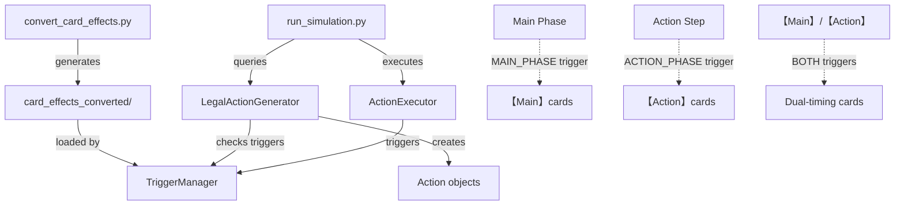
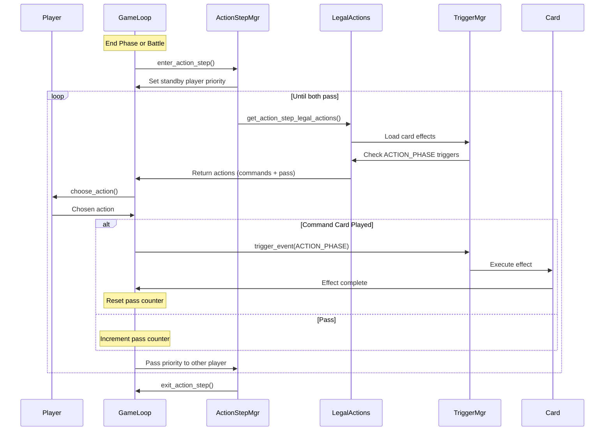

# Command Card and Action Timing Implementation Plan

## Problem Summary

Command cards with `【Main】/【Action】` are currently only getting `ACTION_PHASE` trigger, when they should have **BOTH** `MAIN_PHASE` and `ACTION_PHASE` triggers. Additionally, the simulator lacks proper command card playing logic and action step implementation.

## Architecture Overview



## Fix 1: Update Card Effect Conversion

**File:** [`convert_card_effects.py`](convert_card_effects.py)

### Changes Required

#### 1.1 Fix dual-timing trigger extraction (lines 928-932)

**Current code:**

```python
if '【Main】/【Action】' in text or '【Action】/【Main】' in text:
    if "ACTION_PHASE" not in triggers:
        triggers.append("ACTION_PHASE")
```

**Fix:** Add BOTH triggers for dual-timing cards

```python
# Handle 【Main】/【Action】 pattern (either timing)
if '【Main】/【Action】' in text or '【Action】/【Main】' in text:
    # Card can be played at EITHER timing
    if "MAIN_PHASE" not in triggers:
        triggers.append("MAIN_PHASE")
    if "ACTION_PHASE" not in triggers:
        triggers.append("ACTION_PHASE")
```

#### 1.2 Verify fallback logic (lines 162-169)

The fallback for Command cards without detected triggers defaults to `ACTION_PHASE` only. This should remain as-is since it's a safety net, but verify it's not catching dual-timing cards.

### Testing Strategy

After this fix, regenerate all command card effects:

```bash
python convert_card_effects.py
```

Then verify a sample dual-timing card (e.g., GD01-101):

- Should have triggers: `["MAIN_PHASE", "ACTION_PHASE"]`
- Not just `["ACTION_PHASE"]`

---

## Fix 2: Implement Command Card Playing in Legal Actions

**File:** [`simulator/random_agent.py`](simulator/random_agent.py)

### Changes Required

#### 2.1 Add PLAY_COMMAND to ActionType enum (line 16)

```python
class ActionType(Enum):
    """Types of actions available in the game"""
    PASS = "pass"
    PLAY_UNIT = "play_unit"
    PLAY_COMMAND = "play_command"  # NEW
    ATTACK_PLAYER = "attack_player"
    ATTACK_UNIT = "attack_unit"
    DISCARD = "discard"
    END_PHASE = "end_phase"
```

#### 2.2 Update Action.**str** method (lines 36-49)

Add case for PLAY_COMMAND:

```python
elif self.action_type == ActionType.PLAY_COMMAND:
    return f"PLAY_COMMAND: {self.card.name}"
```

#### 2.3 Enhance LegalActionGenerator.get_legal_actions (lines 58-117)

**Insert after unit playing logic (around line 80):**

```python
# 2. Can play command cards with 【Main】 during Main Phase
for card in player.hand:
    if card.type == 'COMMAND' and LegalActionGenerator._can_play_card(player, card):
        # Load card effect to check triggers
        from simulator.trigger_manager import get_trigger_manager
        trigger_manager = get_trigger_manager()
        effect_data = trigger_manager.effects_cache.get(card.id)
        
        if effect_data:
            effects = effect_data.get("effects", [])
            for effect in effects:
                triggers = effect.get("triggers", [])
                # Can play if has MAIN_PHASE trigger
                if "MAIN_PHASE" in triggers:
                    actions.append(Action(ActionType.PLAY_COMMAND, card=card))
                    break  # One action per command card
```

**Note:** For action step timing, see Fix 3 below.

#### 2.4 Update ActionExecutor.execute_action (after line 231)

**Insert new handler:**

```python
elif action.action_type == ActionType.PLAY_COMMAND:
    # Play command card
    card = action.card
    
    # Pay cost (rest resources)
    if player.get_active_resources() >= card.cost:
        # Remove from hand
        if card in player.hand:
            player.hand.remove(card)
        
        # Rest resources to pay cost
        resources_to_rest = card.cost
        for resource in player.resource_area:
            if not resource.is_rested and resources_to_rest > 0:
                resource.is_rested = True
                resources_to_rest -= 1
        
        # Trigger command effect via TriggerManager
        from simulator.trigger_manager import get_trigger_manager
        from simulator.effect_integration import EffectIntegration
        
        trigger_manager = get_trigger_manager()
        
        # Determine which trigger to use
        current_trigger = "MAIN_PHASE"
        if hasattr(game_state, 'in_action_step') and game_state.in_action_step:
            current_trigger = "ACTION_PHASE"
        
        # Execute command effect
        results = trigger_manager.trigger_event(
            event_type=current_trigger,
            game_state=game_state,
            source_card=card,
            source_player_id=player.player_id
        )
        
        # Place command card in trash after resolution
        player.trash.append(card)
        
        result = f"Played {card.name}: {'; '.join(results)}"
        return game_state, result
    
    return game_state, "Failed: Cannot afford command card"
```

---

## Fix 3: Implement Action Step System

### Phase 3.1: Add Action Step State Tracking

**File:** [`simulator/game_manager.py`](simulator/game_manager.py)

#### 3.1.1 Add fields to GameState (around line 163)

```python
# Battle tracking
in_battle: bool = False
battle_attacker: Optional[UnitInstance] = None
battle_defender: Optional[UnitInstance] = None
battle_phase: Optional[BattlePhase] = None

# Action step tracking (NEW)
in_action_step: bool = False  # True during action steps
action_step_priority_player: int = 0  # Player with current priority
action_step_consecutive_passes: int = 0  # Track passes for ending
```

### Phase 3.2: Create Action Step Manager

**New File:** `simulator/action_step_manager.py`

```python
"""
Action Step Manager for Gundam Card Game
Handles priority-based action step resolution during battle and end phase
"""
from typing import List, Tuple
from simulator.game_manager import GameState, Phase
from simulator.random_agent import Action, ActionType, LegalActionGenerator


class ActionStepManager:
    """Manages action step execution with priority passing"""
    
    @staticmethod
    def enter_action_step(game_state: GameState, is_battle: bool = False) -> GameState:
        """
        Enter action step. Standby player gets priority first.
        
        Args:
            game_state: Current game state
            is_battle: True if action step during battle, False if end phase
            
        Returns:
            Updated game state
        """
        game_state.in_action_step = True
        
        # RULE 9-3: Standby (non-active) player gets priority first
        standby_player = 1 - game_state.turn_player
        game_state.action_step_priority_player = standby_player
        game_state.action_step_consecutive_passes = 0
        
        return game_state
    
    @staticmethod
    def get_action_step_legal_actions(game_state: GameState) -> List[Action]:
        """
        Get legal actions during action step.
        
        Can activate:
 - 【Action】 Command cards
 - 【Activate･Action】 effects
        
        Args:
            game_state: Current game state
            
        Returns:
            List of legal actions
        """
        actions = []
        priority_player_id = game_state.action_step_priority_player
        player = game_state.players[priority_player_id]
        
        # 1. Can play 【Action】 command cards
        from simulator.trigger_manager import get_trigger_manager
        trigger_manager = get_trigger_manager()
        
        for card in player.hand:
            if card.type == 'COMMAND' and LegalActionGenerator._can_play_card(player, card):
                effect_data = trigger_manager.effects_cache.get(card.id)
                
                if effect_data:
                    effects = effect_data.get("effects", [])
                    for effect in effects:
                        triggers = effect.get("triggers", [])
                        # Can play if has ACTION_PHASE trigger
                        if "ACTION_PHASE" in triggers:
                            actions.append(Action(ActionType.PLAY_COMMAND, card=card))
                            break
        
        # 2. Can activate 【Activate･Action】 abilities
        # TODO: Implement activated abilities from units in play
        # This requires checking units in battle area for ACTIVATE_ACTION triggers
        
        # 3. Can always pass
        actions.append(Action(ActionType.PASS))
        
        return actions
    
    @staticmethod
    def handle_action_step_action(game_state: GameState, action: Action) -> Tuple[GameState, bool]:
        """
        Handle an action during action step.
        
        Args:
            game_state: Current game state
            action: Chosen action
            
        Returns:
            Tuple of (updated game_state, action_step_continues)
        """
        if action.action_type == ActionType.PASS:
            # Increment consecutive passes
            game_state.action_step_consecutive_passes += 1
            
            # Check if both players passed
            if game_state.action_step_consecutive_passes >= 2:
                # Action step ends
                return game_state, False
            
            # Pass priority to other player
            game_state.action_step_priority_player = 1 - game_state.action_step_priority_player
            return game_state, True
        
        else:
            # Action was taken - reset pass counter
            game_state.action_step_consecutive_passes = 0
            
            # Execute the action (command card or activated ability)
            # This will be handled by ActionExecutor
            
            # Pass priority to other player
            game_state.action_step_priority_player = 1 - game_state.action_step_priority_player
            return game_state, True
    
    @staticmethod
    def exit_action_step(game_state: GameState) -> GameState:
        """Exit action step"""
        game_state.in_action_step = False
        game_state.action_step_priority_player = 0
        game_state.action_step_consecutive_passes = 0
        return game_state
```

### Phase 3.3: Integrate Action Step into Game Loop

**File:** [`simulator/run_simulation.py`](simulator/run_simulation.py)

#### 3.3.1 Import ActionStepManager (top of file)

```python
from simulator.action_step_manager import ActionStepManager
```

#### 3.3.2 Add action step to End Phase (around line 400)

Find the END PHASE section and add action step before end step:

```python
# END PHASE
logger.log_phase_transition(game_state, "END PHASE")
game_state.current_phase = Phase.END

# ACTION STEP (Rule 9-1: during end phase)
logger.log(">>> Action Step (End Phase)", 1)
game_state = ActionStepManager.enter_action_step(game_state, is_battle=False)

action_step_iterations = 0
max_action_step_iterations = 20  # Safety limit

while action_step_iterations < max_action_step_iterations:
    # Get legal actions for player with priority
    legal_actions = ActionStepManager.get_action_step_legal_actions(game_state)
    
    priority_player_id = game_state.action_step_priority_player
    priority_agent = agents[priority_player_id]
    
    logger.log(f"  Priority Player: {priority_player_id}", 2)
    
    # Agent chooses action
    chosen_action = priority_agent.choose_action(game_state, legal_actions)
    logger.log(f"  Action: {chosen_action}", 2)
    
    # Handle pass
    if chosen_action.action_type == ActionType.PASS:
        game_state, continues = ActionStepManager.handle_action_step_action(
            game_state, chosen_action
        )
        
        if not continues:
            logger.log("  Both players passed - Action Step ends", 2)
            break
    else:
        # Execute action
        game_state, result = ActionExecutor.execute_action(game_state, chosen_action)
        logger.log(f"  Result: {result}", 2)
        
        game_state, continues = ActionStepManager.handle_action_step_action(
            game_state, chosen_action
        )
    
    action_step_iterations += 1

game_state = ActionStepManager.exit_action_step(game_state)

# Continue with END STEP, HAND STEP, etc.
```

#### 3.3.3 Add action step to battle sequence

In the battle resolution code (likely in a separate battle manager), add action step after block step:

```python
# After BLOCK_STEP
game_state = ActionStepManager.enter_action_step(game_state, is_battle=True)
# ... run action step loop similar to end phase ...
game_state = ActionStepManager.exit_action_step(game_state)
# Then proceed to DAMAGE_STEP
```

---

## Data Flow Diagram



---

## Testing Checklist

After implementing all fixes:

### Unit Tests

1. **Trigger Extraction Test**: Verify `【Main】/【Action】` cards get both triggers

      - Load GD01-101 effect JSON
      - Assert triggers contains both "MAIN_PHASE" and "ACTION_PHASE"

2. **Legal Action Test**: Verify command cards appear in legal actions

      - Main Phase: 【Main】 and 【Main】/【Action】 cards should be playable
      - Action Step: 【Action】 and 【Main】/【Action】 cards should be playable

3. **Action Step Priority Test**: Verify standby player goes first

      - Enter action step with turn_player=0
      - Assert action_step_priority_player=1

### Integration Tests

1. Play a 【Main】/【Action】 command card during Main Phase
2. Play a 【Main】/【Action】 command card during Action Step (end phase)
3. Verify action step ends when both players pass consecutively
4. Verify priority alternates correctly

### Regression Tests

- Ensure existing unit playing, attacking still works
- Verify 【Burst】 effects still trigger correctly

---

## Files to Modify

1. **[convert_card_effects.py](convert_card_effects.py)** (lines 928-932)

      - Fix dual-timing trigger extraction

2. **[simulator/random_agent.py](simulator/random_agent.py)** 

      - Add PLAY_COMMAND action type (line 16)
      - Add command card legal actions (line ~80)
      - Add command card execution (line ~231)

3. **[simulator/game_manager.py](simulator/game_manager.py)** (line ~163)

      - Add action step state tracking fields

4. **[simulator/action_step_manager.py](simulator/action_step_manager.py)** (NEW FILE)

      - Create action step manager module

5. **[simulator/run_simulation.py](simulator/run_simulation.py)** (line ~400)

      - Integrate action step into end phase
      - Add action step to battle sequence

---

## Implementation Order

1. **First**: Fix trigger extraction in convert_card_effects.py and regenerate
2. **Second**: Add PLAY_COMMAND action type and execution
3. **Third**: Implement action step system
4. **Fourth**: Write tests and verify